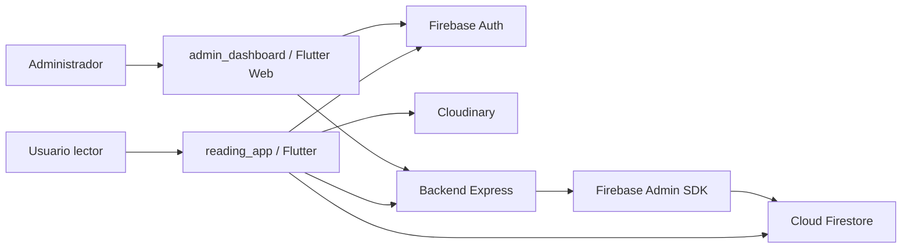
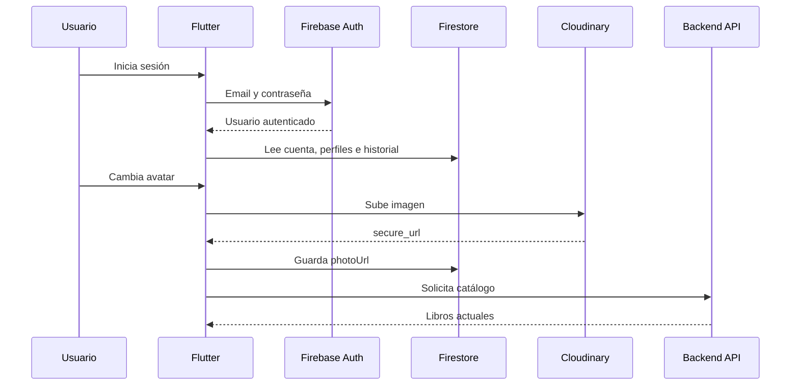

# Arquitectura General

## Visión general

Mini Read utiliza una arquitectura distribuida. Flutter consume Firebase directamente para autenticación y parte de los datos personales, mientras que la API Express ofrece operaciones administrativas y endpoints de catálogo.

## Responsabilidades

| Capa | Responsabilidad real |
|---|---|
| Flutter móvil | UI, navegación, estado, perfiles, lectura, IA simulada, acceso directo a Firestore |
| Firebase Auth | Identidad, sesión persistente y emisión de ID tokens |
| Firestore | Cuenta, perfiles legacy, historial, chats IA y transacciones |
| Cloudinary | Avatares de cuenta y perfiles lectores |
| Backend Express | API protegida, CRUD administrativo, operaciones transaccionales |
| Dashboard | Operación administrativa y métricas |

## Flujo de datos

## Decisiones arquitectónicas

- **Provider/ChangeNotifier** centraliza estado reactivo sin introducir una infraestructura excesiva.
- **Repository Pattern** separa contratos de dominio de fuentes de datos.
- **Firebase Auth y Firestore** reducen complejidad operativa durante la etapa académica.
- **Cloudinary** centraliza archivos visuales; Firestore conserva únicamente URLs y metadatos.
- **Backend con Firebase Admin** permite operaciones privilegiadas que no deben ejecutarse desde clientes.

## Estado de evolución

La arquitectura es funcional, pero mantiene componentes legacy. `HomeController` y `FirebaseLibraryDataSource` concentran múltiples responsabilidades. La migración prevista separará perfiles, membresías, progreso, favoritos y reseñas en módulos propios.

