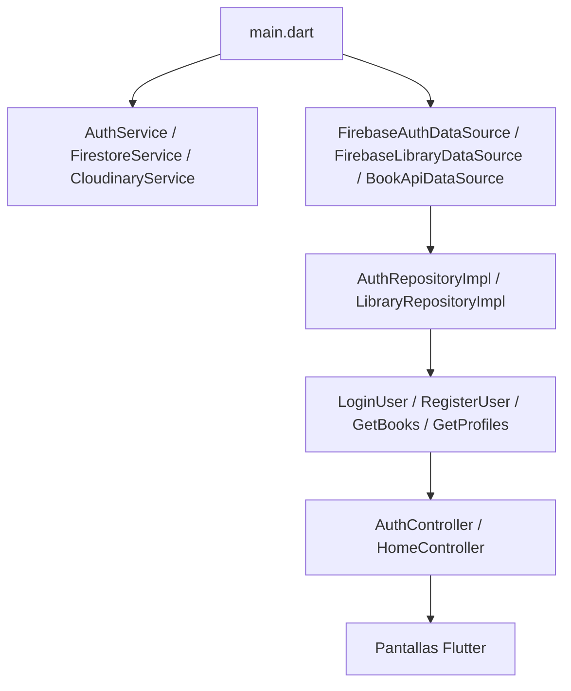

# Arquitectura Frontend

## Aplicación lectora

La entrada se encuentra en `reading_app/lib/main.dart`. Allí se inicializan Firebase, servicios, datasources, repositorios, controladores y Cloudinary.

## Navegación

`MiniReadApp` utiliza `onGenerateRoute`.

| Ruta | Pantalla | Uso |
|---|---|---|
| `/` | `AuthGate` | Decide login o cuenta autenticada |
| `/register` | `RegisterPage` | Registro |
| `/onboarding` | `OnboardingPreferencesPage` | Creación inicial de perfil lector |
| `/profiles` | `ProfileSelectionPage` | Actualmente representa el perfil/cuenta del lector |
| `/home` | `HomeScreen` | Catálogo personalizado |
| `/book` | `BookDetailPage` | Detalle del libro |
| `/read` | `ReadingPage` | Lectura paginada |

## Estado

`LibraryController` extiende `HomeController`, que a su vez extiende `ChangeNotifier`. `MiniReadApp` lo publica como `ChangeNotifierProvider<HomeController>`.

Responsabilidades actuales de `HomeController`:

- Cargar catálogo, cuenta, perfiles y dashboard lector.
- Mantener perfil activo.
- Filtrar catálogo por audiencia y preferencias.
- Crear perfiles legacy.
- Gestionar tokens, racha, acceso IA y progreso.
- Actualizar identidad de la cuenta.

## Pantallas principales

| Pantalla | Función |
|---|---|
| Login | Autenticación premium visual |
| Registro | Creación de cuenta |
| Onboarding | Edad, intereses y perfil lector |
| Home | Catálogo, búsqueda, recompensas y estado premium |
| Perfil | Cuenta, estadísticas, actividad, biblioteca y configuración |
| Detalle | Información y acceso al libro |
| Lectura | Páginas, progreso e interacción IA |

## Riesgos técnicos

- `HomeController` tiene demasiadas responsabilidades.
- `FirebaseLibraryDataSource` agrupa cuenta, perfiles, tokens, progreso, IA y notas.
- La pantalla de perfil se llama todavía `ProfileSelectionPage`, aunque ya no es un selector.
- Varias operaciones críticas se ejecutan directamente desde Flutter.

