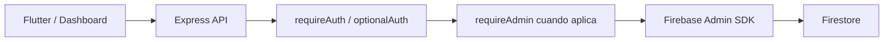

# Arquitectura Backend

## Descripción

El backend se encuentra en `backend/` y utiliza Node.js, Express y Firebase Admin SDK. Está preparado para despliegue en Vercel.

## Componentes

| Archivo | Responsabilidad |
|---|---|
| `src/app.js` | Rutas REST y lógica transaccional |
| `src/middleware.js` | Verificación de ID token y rol admin |
| `src/firebase.js` | Inicialización Firebase Admin |
| `src/utils.js` | Serialización, colecciones permitidas y helpers |
| `api/index.js` | Entrada para desarrollo/Vercel |

## Endpoints reales

| Método | Ruta | Protección | Estado |
|---|---|---|---|
| GET | `/api/health` | Pública | Implementado |
| GET | `/api/books` | Opcional | Devuelve catálogo mock en memoria |
| GET | `/api/books/:bookId` | Opcional | Lee Firestore |
| POST/PATCH/DELETE | `/api/books...` | Admin | CRUD Firestore |
| GET/PATCH | `/api/me` | Autenticado | Cuenta actual |
| GET/POST/PATCH/DELETE | `/api/profiles...` | Autenticado | Perfiles legacy |
| POST | `/api/profiles/:id/check-in` | Autenticado | Racha y recompensa |
| POST | `/api/profiles/:id/reward-ad` | Autenticado | Recompensa tokens |
| POST | `/api/ai/validate` | Autenticado | Valida y descuenta tokens |
| GET/PUT | `/api/history-reading...` | Autenticado | Historial/progreso actual |
| GET/POST | `/api/ia-chats` | Autenticado | Chats actuales |
| GET | `/api/token-transactions` | Autenticado | Movimientos propios |
| CRUD | `/api/admin/:collection` | Admin | CRUD genérico permitido |

## Seguridad backend

`requireAuth` verifica el bearer token mediante `auth.verifyIdToken`. `requireAdmin` acepta un custom claim `admin: true` o un documento `users/{uid}` con rol `admin` u `owner`.

El CRUD genérico está limitado a `books`, `users`, `history_reading`, `ia_chats` y `token_transactions`.

## Limitaciones actuales

- `/api/books` no consulta Firestore: devuelve libros mock con `pages[]`.
- La IA mostrada en Flutter genera respuestas simuladas; no existe integración con un proveedor IA externo.
- No existen endpoints específicos para memberships, favorites, reviews o reading_progress V1.

