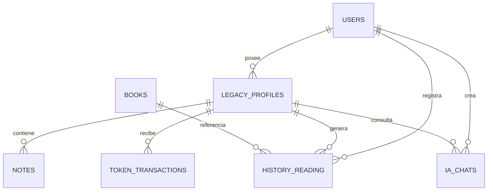
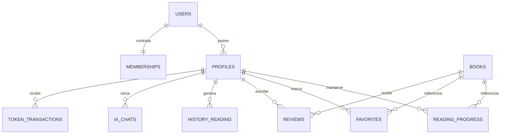

# Base de Datos Firestore

## Estado de las colecciones

| Ruta | Uso actual | Estado |
|---|---|---|
| `users/{uid}` | Cuenta autenticada, identidad, rol e `isPremium` | Implementado |
| `users/{uid}/perfiles/{profileId}` | Perfiles lectores, tokens y racha | Implementado legacy |
| `users/{uid}/perfiles/{profileId}/notes/{noteId}` | Notas de perfil | Infraestructura implementada |
| `books/{bookId}` | CRUD administrativo y detalle por API | Parcial; catálogo principal usa mock |
| `history_reading/{profileId-bookId}` | Última página leída | Implementado |
| `ia_chats/{chatId}` | Pregunta/respuesta IA actual | Implementado con respuesta simulada |
| `token_transactions/{id}` | Auditoría de recompensas y consumos | Implementado |
| `profiles/{profileId}` | Perfiles lectores V2 | Preparado en reglas, no migrado |
| `memberships/{uid}` | Membresías V1 | Preparado en reglas |
| `reading_progress/{id}` | Progreso V1 | Preparado en reglas |
| `favorites/{id}` | Favoritos | Preparado en reglas |
| `reviews/{id}` | Reseñas | Preparado en reglas |
| `notifications/{id}` | Notificaciones | Preparado en reglas |
| `achievements/{id}` | Catálogo de logros | Preparado en reglas |

## Campos actuales principales

### `users/{uid}`

Campos observados: `uid`, `email`, `name`, `displayName`, `photoUrl`, `bio`, `favoriteGenres`, `role`, `isPremium`, `preferences`, `createdAt`, `updatedAt`.

### `users/{uid}/perfiles/{profileId}`

Campos observados: `name`, `avatarUrl`, `role`, `tokens`, `dailyStreak`, `lastLoginDate`, `ageGroup`, `readingMood`, `favoriteCategories`, `preferences`, `accentColor`, `createdAt`, `updatedAt`.

### `history_reading/{profileId-bookId}`

Campos actuales: `uid`, `profileId`, `bookId`, `lastPageRead`, `updatedAt`.

### `ia_chats/{chatId}`

Campos actuales: `uid`, `profileId`, `bookId`, `pageNumber`, `type`, `question`, `answer`, `pageContext`, `createdAt`.

### `token_transactions/{id}`

Campos actuales: `uid`, `profileId`, `bookId` opcional, `pageNumber` opcional, `amount`, `type`, `createdAt`.

## Relaciones actuales

## Modelo objetivo preparado

| Colección objetivo | Propósito | Campos previstos |
|---|---|---|
| `profiles` | Perfil lector desacoplado de la cuenta | `profileId`, `userId`, `name`, `avatarUrl`, `bio`, `favoriteGenres`, `ageRange`, `tokens`, `streak`, `isDefault`, `isChild`, timestamps |
| `memberships` | Estado de suscripción | `userId`, `plan`, `status`, `startDate`, `endDate`, `trialUsed`, timestamps |
| `reading_progress` | Posición actual y porcentaje | `progressId`, `userId`, `profileId`, `bookId`, `currentPage`, `progress`, `lastReadAt` |
| `favorites` | Relación perfil-libro favorita | `favoriteId`, `userId`, `profileId`, `bookId`, `createdAt` |
| `reviews` | Valoración y comentario | `reviewId`, `userId`, `profileId`, `bookId`, `rating`, `comment`, `createdAt` |
| `notifications` | Mensajes dirigidos al usuario | `notificationId`, `userId`, `title`, `message`, `read`, `createdAt` |
| `achievements` | Catálogo de logros | `achievementId`, `title`, `description`, `reward`, `icon` |

## Observación crítica

Las reglas Firestore ya autorizan colecciones objetivo, pero esto no significa que existan datos o flujos de aplicación para ellas. La documentación distingue “preparado en reglas” de “implementado”.
