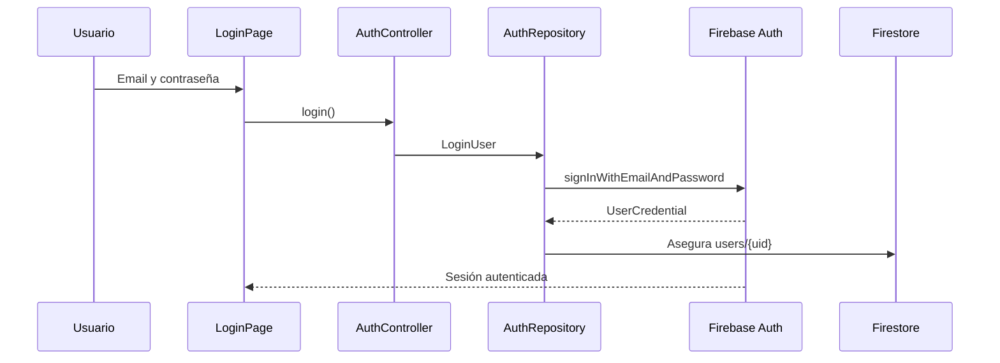

# Autenticación

## Proveedor

Mini Read utiliza Firebase Auth con correo electrónico y contraseña.

## Registro

1. `RegisterPage` valida correo, contraseña y confirmación.
2. `AuthController` ejecuta el caso de uso `RegisterUser`.
3. `FirebaseAuthDataSourceImpl` llama `createUserWithEmailAndPassword`.
4. Se crea o asegura el documento `users/{uid}`.
5. La navegación dirige al onboarding de preferencias.

## Login

1. `LoginPage` recoge correo y contraseña.
2. La capa de dominio ejecuta `LoginUser`.
3. Firebase Auth valida credenciales.
4. Se actualiza el documento de usuario si es necesario.
5. `AuthGate` detecta la sesión y carga la biblioteca.

## Persistencia de sesión

Firebase Auth conserva la sesión en el dispositivo. `AuthGate` escucha `FirebaseAuth.instance.authStateChanges()`. Al reiniciar la aplicación, si Firebase conserva un usuario válido, Mini Read carga directamente su estado.

Este comportamiento es comparable al acceso persistente de Netflix o Spotify: el usuario no introduce credenciales en cada apertura, salvo cierre de sesión, revocación o expiración gestionada por Firebase.

## Recuperación de contraseña

La interfaz muestra “Recuperar contraseña”, pero actualmente solo informa que estará disponible próximamente. No existe llamada a `sendPasswordResetEmail`.

**Estado:** trabajo futuro.

## Cierre de sesión

El perfil limpia el estado local del controlador y ejecuta `FirebaseAuth.instance.signOut()`. El `AuthGate` vuelve automáticamente a Login.

