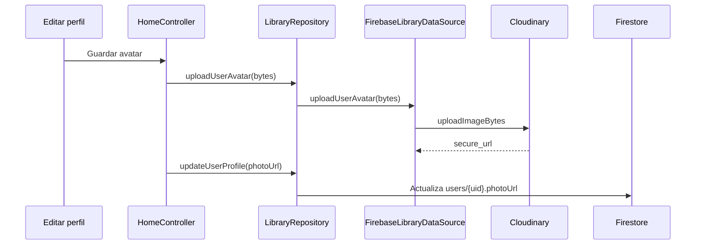

# Cloudinary

## Motivo de selección

Cloudinary es el proveedor activo de almacenamiento de archivos visuales en Mini Read. Firestore conserva únicamente las URLs retornadas.

Ventajas consideradas:

- Distribución CDN.
- URLs HTTPS listas para consumo.
- Organización por carpetas.
- Transformaciones de imagen disponibles.
- Separación entre archivos y base de datos.

## Configuración actual

La aplicación carga desde `reading_app/.env`:

```text
CLOUDINARY_CLOUD_NAME=deussxkkg
CLOUDINARY_UPLOAD_PRESET=mini_read_unsigned
```

El preset es unsigned. No se almacena un API secret en Flutter.

## Servicio

`CloudinaryService.uploadImageBytes()`:

1. Valida configuración.
2. Rechaza imágenes vacías.
3. Limita tamaño a 5 MB.
4. Admite JPEG, JPG, PNG y WebP.
5. Ejecuta un multipart POST.
6. Devuelve `secure_url`.

## Estructura utilizada y objetivo

```text
mini_read/
├── avatars/
│   ├── users/{uid}/
│   └── profiles/{profileId}/
├── covers/        # futuro
├── pdfs/          # futuro
└── banners/       # futuro
```

Cada actualización de avatar genera un `publicId` con timestamp para evitar conflictos de caché y permitir reemplazos visibles.

## Flujo de subida



## Seguridad

Un preset unsigned debe limitar formato, tamaño y carpeta desde Cloudinary. Para producción a gran escala se recomienda upload firmado por backend, especialmente para PDFs y recursos administrativos.

## Firebase Storage

`StorageService` y la dependencia `firebase_storage` permanecen como legado inactivo. No están conectados al flujo actual de avatares.

