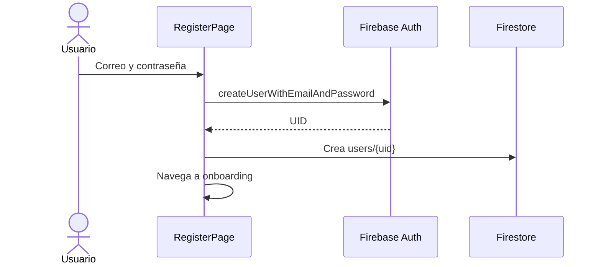
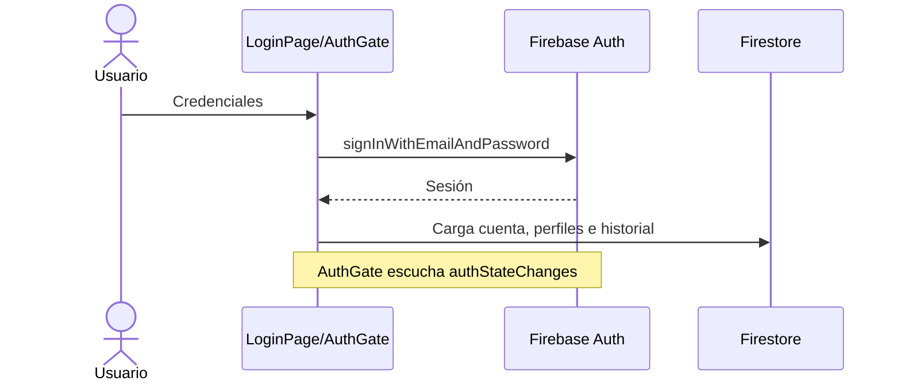
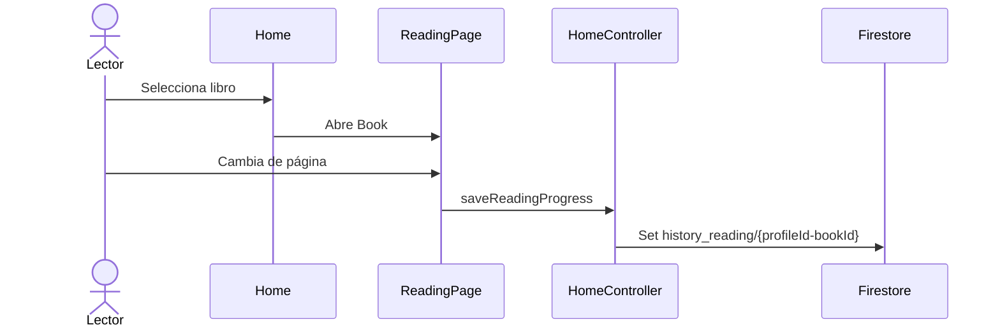
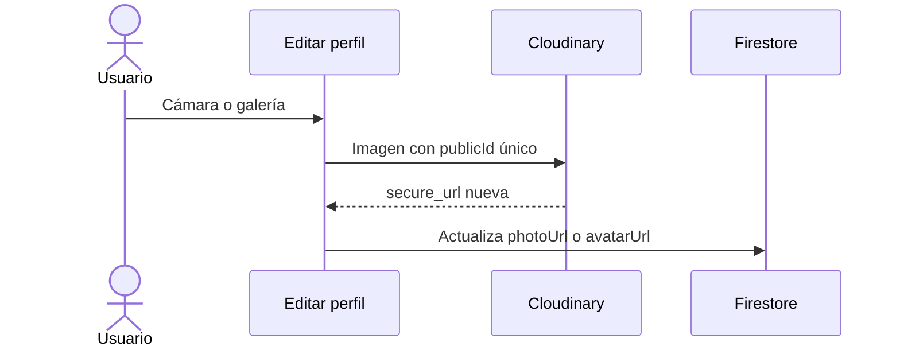
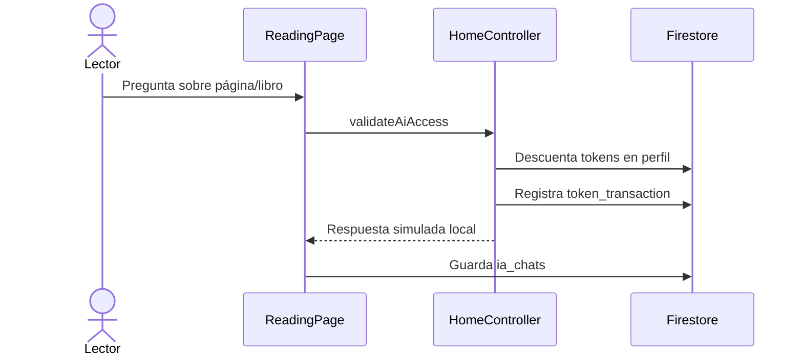

# Flujos del Sistema

## Registro

## Login y sesión persistente

## Lectura

## Actualización de avatar

## Consulta IA actual

La respuesta IA todavía es simulada en `HomeController.mockAiAnswer`; no existe integración con un modelo externo.

