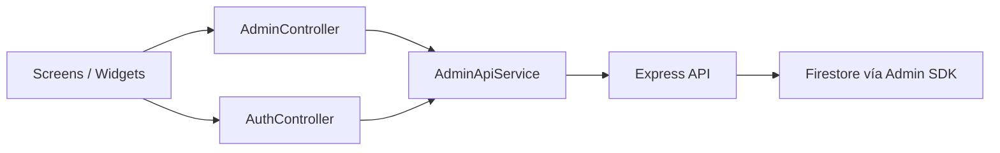

# Admin Dashboard

## Descripción

`admin_dashboard` es una aplicación Flutter Web independiente. Se comunica con el backend Express y utiliza Firebase Auth para obtener el ID token.

## Arquitectura

## Secciones reales

| Sección | Función |
|---|---|
| Dashboard | Métricas, gráficos y actividad reciente |
| Usuarios y libros | Búsqueda, usuarios, roles, premium, bloqueo, CRUD de libros |
| Tokens | Historial cronológico de movimientos |
| Configuración | Sesión, tema y resumen operativo |

## Métricas

`AdminController` calcula:

- Total de usuarios.
- Usuarios premium.
- Total de libros.
- Tokens en circulación.
- Número de preguntas IA.

## Gestión de usuarios

El administrador puede:

- Convertir usuario en premium.
- Asignar rol admin.
- Alternar el campo `banned`.

Estas acciones actualizan documentos mediante `/api/admin/users/{docId}`. El campo `banned` no deshabilita automáticamente la cuenta Firebase Auth; actualmente funciona como dato administrativo.

## Gestión de libros

Permite crear y editar libros mediante endpoints protegidos. El modelo administrativo sigue generando `pages[]`, por lo que todavía no administra PDFs.

## Moderación y reportes

El dashboard permite observar chats IA y movimientos de tokens, pero no existe todavía un módulo formal de moderación de reseñas, reportes descargables o gestión de denuncias.

