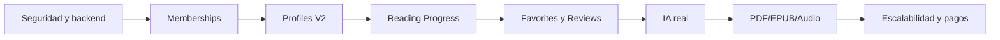

# Trabajo Futuro

## Prioridad alta

1. Mover operaciones de tokens y premium al backend.
2. Unificar el catálogo público con `books` de Firestore.
3. Implementar `memberships/{uid}` y retirar autoridad de `isPremium` cliente.
4. Migrar perfiles legacy hacia `profiles/{profileId}` con lectura/escritura dual.
5. Crear `reading_progress` y separar progreso de historial.

## Lectura digital

- Reemplazar dependencia de `pages[]` por PDFs.
- Añadir lector PDF estable.
- Incorporar EPUB y audiolibros.
- Permitir modo offline con sincronización posterior.

## IA avanzada

- Integrar proveedor IA real.
- Crear chats por libro con subcolección `messages`.
- Limitar contexto al contenido autorizado.
- Añadir moderación, cuotas y control de costos.

## Comunidad

- Favoritos funcionales.
- Listas de lectura.
- Reseñas y valoraciones.
- Comentarios y actividad social.
- Recomendaciones personalizadas.

## Gamificación

- Catálogo de logros.
- Desbloqueos por rachas y libros terminados.
- Tokens gestionados exclusivamente por backend.
- Tableros familiares o educativos.

## Operación

- Pagos y renovaciones de membresía.
- Notificaciones.
- Reportes administrativos.
- Moderación de contenido y reseñas.
- Pruebas automatizadas de reglas Firestore.
- Observabilidad, alertas y auditoría.

## Roadmap resumido

